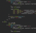

  

  <b>i love science</b>  <b>i love coding</b>  <b>and i love learning</b> 

  <b>Salut, moi c'est Madiba Elate Albert Emmanuel</b> 👋

  Passionné de science, de tech et du savoir — en <b>Terminale C</b> au Lycée Joss 🎓 Objectif : 18/20
   
  je construis, je casse, je répare, je recommence 🔧

 

## 🛠️ Je construis des solutions avec :

<table>
  <tr>
    <td align="center" width="96"> <b>React & Native</b></td>
    <td align="center" width="96"> <b>Node.js</b></td>
    <td align="center" width="96"> <b>Python AI</b></td>
    <td align="center" width="96"> <b>C++ / Genesis</b></td>
    <td align="center" width="96"> <b>Flutter</b></td>
    <td align="center" width="96"> <b>n8n</b></td>
  </tr>
  <tr>
    <td align="center" width="96"> <b>AWS</b></td>
    <td align="center" width="96"> <b>Docker</b></td>
    <td align="center" width="96"> <b>Kubernetes</b></td>
    <td align="center" width="96"> <b>TensorFlow</b></td>
    <td align="center" width="96"> <b>PostgreSQL</b></td>
    <td align="center" width="96"> <b>MongoDB</b></td>
  </tr>
  <tr>
    <td align="center" width="96"> <b>TypeScript</b></td>
    <td align="center" width="96"> <b>Solidity</b></td>
    <td align="center" width="96"> <b>Rust</b></td>
    <td align="center" width="96"> <b>Linux Infra</b></td>
    <td align="center" width="96"> <b>Redis</b></td>
    <td align="center" width="96">
🦜
 <b>LangChain</b></td>
  </tr>
</table>

 

## 🔥 projets en cours

**<a href="https://github.com/madiba-elate/Genesis">Genesis</a>** — un seul écosystème pour unifier le dev 🌍

**<a href="https://github.com/madiba-elate/Prometheus">Prometheus</a>** — agent CLI autonome 24/7 🤖

**<a href="https://github.com/madiba-elate/Krypton">Krypton</a>** — messagerie privée sécurité maximale 🔐

**<a href="https://github.com/madiba-elate/Poiesis">Poiesis</a>** — DSL pour la création artistique 🎨

**<a href="https://github.com/madiba-elate/S.M.A.R.T">S.M.A.R.T</a>** — assistant éducatif pour élèves et étudiants 🎓

  

## 🎯 objectifs 2026

- [ ] **Genesis MVP** — parser, AST, compilateur WASM
- [ ] **Prometheus v1** — agent autonome 24/7 stable
- [ ] **Krypton** — version stable
- [ ] **Poiesis v1**
- [ ] **S.M.A.R.T** — version production

 

  <i>"S'adapter en permanence pour résoudre des problèmes."</i> — <b>Madiba Elate</b>

  

 

  
  
  

