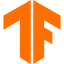

  

  <b>i love science</b>  <b>i love coding</b>  <b>and i love learning</b> 

  <b>Salut, moi c'est Madiba Elate Albert Emmanuel</b> 👋

  Passionné de science, de tech et du savoir — en <b>Terminale C</b> au Lycée Joss 🎓 Objectif : 18/20
   
  je construis, je casse, je répare, je recommence 🔧

 

## 🛠️ Je construis des solutions avec :

<table>
  <tr>
    <td align="center" width="96"> <b>React</b></td>
    <td align="center" width="96"> <b>Node.js</b></td>
    <td align="center" width="96"> <b>Python</b></td>
    <td align="center" width="96"> <b>C++</b></td>
    <td align="center" width="96"> <b>Flutter</b></td>
    <td align="center" width="96"> <b>n8n</b></td>
  </tr>
  <tr>
    <td align="center" width="96"> <b>AWS</b></td>
    <td align="center" width="96"> <b>Docker</b></td>
    <td align="center" width="96"> <b>Kubernetes</b></td>
    <td align="center" width="96"> <b>TensorFlow</b></td>
    <td align="center" width="96"> <b>PostgreSQL</b></td>
    <td align="center" width="96"> <b>MongoDB</b></td>
  </tr>
  <tr>
    <td align="center" width="96"> <b>TypeScript</b></td>
    <td align="center" width="96"> <b>Solidity</b></td>
    <td align="center" width="96"> <b>Rust</b></td>
    <td align="center" width="96"> <b>Linux</b></td>
    <td align="center" width="96"> <b>Redis</b></td>
    <td align="center" width="96"> <b>LangChain</b></td>
  </tr>
</table>

 

## 📜 certifications DataCamp (70+ cours terminés)

<b>🤖 IA & Machine Learning</b>

- Introduction aux GPT
- Concepts d'IA générative
- Comprendre le Machine Learning
- Concepts des grands modèles de langage (LLM)
- Éthique de l'IA
- Pratiques responsables en matière d'IA
- Gouvernance de l'IA
- Implémentation IA en entreprise
- Stratégie IA
- Generative AI pour l'entreprise
- Large Language Models for Business
- Comprendre l'intelligence artificielle
- Introduction à l'IA pour le travail
- Comprendre ChatGPT
- Introduction à ChatGPT
- ChatGPT niveau intermédiaire
- Présentation de Microsoft Copilot

<b>🔗 LangChain & Agents IA</b>

- Concevoir des systèmes agentiques avec LangChain
- Retrieval Augmented Generation (RAG) avec LangChain
- Développement d'applications LLM avec LangChain
- Concevoir des systèmes agentiques évolutifs
- Introduction aux agents d'IA

<b>🔌 API OpenAI & Embeddings</b>

- Systèmes multimodaux avec l'API OpenAI
- Concevoir des systèmes d'IA avec l'API OpenAI
- Ingénierie des prompts avec l'API OpenAI
- Travailler avec l'API OpenAI
- Introduction aux embeddings avec l'API OpenAI
- Nettoyer des données avec l'IA générative
- Coder avec l'aide de l'IA pour les développeurs
- Coder en mode Vibe avec Replit
- Comprendre l'ingénierie des prompts

<b>📊 Data Science & Analytics</b>

- Comprendre la Data Science
- Introduction aux données
- Introduction à la qualité des données
- Introduction à la culture des données
- Formuler des questions analytiques
- Concepts de communication des données
- Principes clés du Data Storytelling
- Communicating Data Insights
- Comprendre la visualisation des données
- Introduction à Tableau
- Concepts de conception de tableaux de bord
- Décisions fondées sur les données en entreprise
- Introduction à la maîtrise de la donnée

<b>🐍 Python</b>

- Introduction à Python
- Python intermédiaire pour les développeurs
- Introduction à Python pour les développeurs
- Écrire du code Python efficace
- Boîte à outils Python
- Types de données en Python
- Écrire des fonctions en Python
- Expressions rationnelles en Python
- Utilisation des dates et des heures en Python
- Principes d'ingénierie logicielle en Python
- Programmation orientée objet intermédiaire en Python
- Introduction à la programmation orientée objet en Python

<b>🗄️ SQL & Data Engineering</b>

- Introduction au SQL
- Présentation de l'ingénierie des données
- Concepts d'entreposage de données
- Concepts de streaming

<b>🔐 Gouvernance & Sécurité des données</b>

- Introduction à la sécurité des données
- Concepts de gouvernance des données
- Introduction à la protection des données

<b>⚙️ MLOps & LLMOps</b>

- Concepts MLOps
- Concepts LLMOps

<b>🔧 Git, Shell & Cloud</b>

- Introduction à Git
- Git intermédiaire
- Introduction au shell
- Comprendre le cloud
- Travailler avec Hugging Face
- Créer des applications d'IA avec Pinecone

 

## 🔥 projets en cours

**<a href="https://github.com/madiba-elate/Genesis">Genesis</a>** — un seul écosystème pour unifier le dev 🌍

**<a href="https://github.com/madiba-elate/Prometheus">Prometheus</a>** — agent CLI autonome 24/7 🤖

**<a href="https://github.com/madiba-elate/Krypton">Krypton</a>** — messagerie privée sécurité maximale 🔐

**<a href="https://github.com/madiba-elate/Poiesis">Poiesis</a>** — DSL pour la création artistique 🎨

**<a href="https://github.com/madiba-elate/S.M.A.R.T">S.M.A.R.T</a>** — assistant éducatif pour élèves et étudiants 🎓

  

## 🎯 objectifs 2026

- [ ] **Genesis MVP** — parser, AST, compilateur WASM
- [ ] **Prometheus v1** — agent autonome 24/7 stable
- [ ] **Krypton** — version stable
- [ ] **Poiesis v1**
- [ ] **S.M.A.R.T** — version production

 

  <i>"S'adapter en permanence pour résoudre des problèmes."</i> — <b>Madiba Elate</b>

  

 

  
  
  
  

